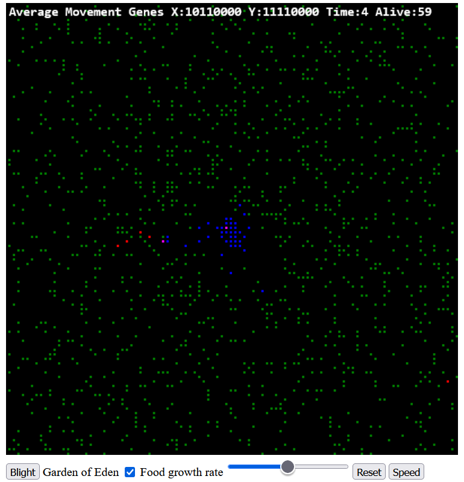

# Evolve

[![MIT licensed][mit-badge]][mit-url]
[![Rust][rust-badge]][rust-url]

[mit-badge]: https://img.shields.io/badge/license-MIT-blue.svg
[mit-url]: https://github.com/david-wallace-croft/com-croftsoft-app-evolve/blob/main/LICENSE.txt
[rust-badge]: https://github.com/david-wallace-croft/com-croftsoft-app-evolve/actions/workflows/rust.yml/badge.svg
[rust-url]: https://github.com/david-wallace-croft/com-croftsoft-app-evolve/actions/workflows/rust.yml

- Evolve the movement of critters through food distribution
- You can see the Rust code compiled to WebAssembly and running in the browser
  - https://www.gamespawn.com/arcade/evolve/

## Update 2026-08-23

- Replaced the webpack build because it stopped working after npm 8.19.4
- See https://github.com/parrotmac/rust-wasm-hello-world

## Usage

- cd com-croftsoft-app-evolve/
- npm install
- npm start

## History

- 2022-09-12: Initial release
- 2026-08-23: Replaced the webpack build
